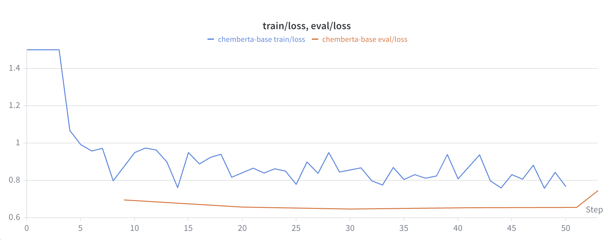
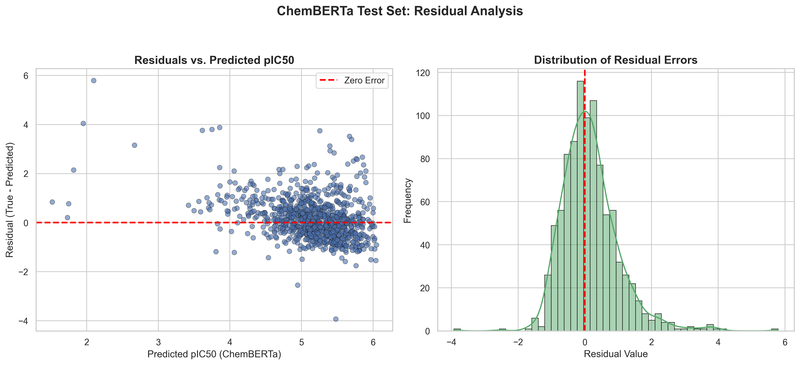

# hERG Toxicity Prediction: A Hybrid Approach
## Overview
The human Ether-à-go-go-Related Gene (hERG) codes for a potassium ion channel essential for normal cardiac repolarization. Because the channel's binding pocket is highly promiscuous, a wide variety of drugs can unintentionally block it, leading to cardiac complications. Unintended hERG blockade is one of the leading causes of late-stage clinical trial failure and post-market drug withdrawal. 

This project aims to predict a molecule's binding affinity to the hERG channel before it is physically synthesized. The target metric is **pIC50** (the negative logarithm of the half-maximal inhibitory concentration). Higher pIC50 values indicate stronger binding and higher toxicity. Because pIC50 is a continuous variable, this project frames toxicity as a regression task. Accurate filtering of hERG liabilities can save pharmaceutical companies millions of dollars and years of development time.

## Architecture
The final model is a hybrid, combining a pre-trained Large Language Model (LLM) with gradient boosting:
1. **Input**: A user submits a 1D SMILES string via the API.
2. **Feature Extraction**: The SMILES is tokenized and passed through a frozen, pre-trained transformer (`DeepChem/ChemBERTa-77M-MTR`). The model extracts the 768-dimensional `[CLS]` token, which contains mathematical representation of the molecule's structural and electronic properties.
3. **Regression**: The embedding is passed to an XGBoost regressor (tuned via a 100-trial Bayesian Optuna search) to output the final pIC50 prediction.
4. **Deployment**: The entire pipeline is packaged in an isolated Docker container with a FastAPI endpoint.

## Model Progression: Why Hybrid?
Before arriving at the hybrid architecture, three independent baselines were established using an 80/10/10 scaffold split on roughly 9,500 compounds from ChEMBL:

1. **Classical Machine Learning (XGBoost + Morgan Fingerprints)**: Using 2D topological bit-vectors yielded an $R^2$ of ~0.23. The model captured basic variance but struggled because 2D fingerprints lack the 3D geometric and electronic information required to model the hERG binding pocket.
2. **Graph Neural Networks (GCN & GAT)**: Training topological graphs from a random initialization largely failed. A standard GCN captured minimal variance ($R^2$ 0.06), while a multi-head Graph Attention Network (GAT) severely overfit the training data $(R^2$ -0.22).
3. **End-to-End LLM FTuning (ChemBERTa)**: Attempting to tune the full 77-million parameter ChemBERTa model with a new regression head also resulted in severe overfitting (R^2 -0.06). While the transformer architecture has the capacity to learn 3D mechanics, a dataset of <10,000 samples resulted in data starvation.

**The Hybrid Pivot**: To solve the data starvation problem, ChemBERTa was frozen and used purely as a feature extractor. Passing its contextual embeddings into XGBoost combined the 3D structural awareness of the LLM with the regression stability of gradient boosted trees. This approach outperformed all baselines, increasing the XGBoost + Morgan Fingerprint $R^2$ by ~11%.

## Results

| Model Architecture | Feature Representation | Test RMSE | Test $R^2$ |
| :--- | :--- | :--- | :--- |
| GAT (Baseline) | 2D Molecular Graph | 0.9269 | -0.2245 |
| ChemBERTa (End-to-End) | 1D SMILES Sequence | 0.8641 | -0.0640 |
| GCN (Baseline) | 2D Molecular Graph | 0.8115 | 0.0614 |
| XGBoost (Baseline) | 2D Morgan Fingerprint | 0.7337 | 0.2328 |
| **XGBoost (Hybrid)** | **ChemBERTa 768-D Embedding** | **0.7041** | **0.2684** |

While an R^2 of ~0.27 appears low, public biological datasets like ChEMBL contain massive inter-lab assay noise. Predicting binding affinity to within 0.7 log units across a multitude of diverse chemical scaffolds establishes a solid early-stage filter for toxicity.

### Visual Diagnostics: The ChemBERTa End-to-End Failure
The visual diagnostics from the end-to-end ChemBERTa fine-tuning phase illustrate why the hybrid pivot was necessary.

**1. Training vs. Validation Loss**   
The validation loss (orange) hits a hard generalization floor early in the run and begins to spike, while training error (blue) continually decreases. This is a textbook indicator of late-stage overfitting due to data starvation. The full wandb report is available [here](https://wandb.ai/kaih-b-johns-hopkins-university/admet-llm/reports/ChemBERTa-Tuning-hERG-pIC50-Prediction--VmlldzoxNjI3ODExMw?accessToken=7d7zq5rq0empxxe0vflaqxmwvju8wh1adi17sk1fm128xh2auv0yxiprhk1zrv4b).

**2. Residual Analysis**   
The model failed to generalize to the extremes of the pIC50 scale. Instead of random scatter, the residuals show a distinct diagonal bias. The model systematically under-predicted highly toxic blockers and over-predicted safe compounds, essentially collapsing its guesses toward the dataset mean.

## Quickstart

The final hybrid model is containerized and ready for local inference.

**1. Clone the repository**
```bash
git clone https://github.com/kaih-b/admet-llm.git
cd admet-llm
```

**2. Build the Docker Image**
```bash
docker build -t admet-api .
```

**3. Run the Container**
```bash
docker run -p 8000:8000 admet-api
```

**4. Use the API**
Open your web browser and navigate to the automatically generated Swagger UI documentation:

`http://127.0.0.1:8000/docs`

From there, you can click `POST /predict`, enter a SMILES string (e.g. Aspirin: `CC(=O)OC1=CC=CC=C1C(=O)O)`), and execute the request to receive a real-time hERG pIC50 prediction.